# 04 - Modele BDD Mermaid

Ce document contient un modele relationnel simplifie avec les tables les plus
importantes.

Il ne liste pas tous les champs techniques, mais il montre les relations
principales du projet.

## Diagramme Mermaid

```mermaid
erDiagram
    ITEM ||--o{ LATEST_PRICE : "has current prices"
    MARKET ||--o{ LATEST_PRICE : "provides"
    ITEM ||--o{ DAILY_SNAPSHOT : "has history"
    MARKET ||--o{ DAILY_SNAPSHOT : "snapshotted from"

    USER ||--o{ SESSION : "owns"
    USER ||--o{ USER_PROFILE_AUDIT : "has audits"
    USER ||--o{ USER_TRACKED_SKIN : "tracks"
    ITEM ||--o{ USER_TRACKED_SKIN : "is tracked"

    USER ||--o{ USER_DASHBOARD_WIDGET : "configures"
    USER ||--o{ USER_INVENTORY_SNAPSHOT : "has inventory snapshots"

    USER ||--o{ USER_MARKETPLACE_LISTING : "tracks listings"
    ITEM ||--o{ USER_MARKETPLACE_LISTING : "listed item"

    USER ||--o{ USER_TRADE : "has trades"
    USER ||--o{ USER_NOTIFICATION : "receives"

    ITEM {
        string id PK
        string variantKey UK
        string marketHashName
        string displayName
        enum itemType
        string weapon
        string skinName
        string exterior
        string rarity
        boolean stattrak
        boolean souvenir
        string phase
        string collection
        string imageUrl
        boolean isActive
    }

    MARKET {
        string id PK
        string slug UK
        string name
        boolean enabled
        int priority
    }

    LATEST_PRICE {
        string id PK
        string itemId FK
        string marketId FK
        decimal price
        decimal minPrice
        decimal medianPrice
        string currency
        int quantity
        int volume
        datetime fetchedAt
        json rawPayload
    }

    DAILY_SNAPSHOT {
        string id PK
        date snapshotDate
        string snapshotHour
        string itemId FK
        string marketId FK
        decimal price
        string currency
        int quantity
        int volume
        datetime sourceFetchedAt
    }

    USER {
        string id PK
        string steamId UK
        string steamPersonaName
        string steamProfileUrl
        string steamAvatar
        string tradeLink
        string phoneNumber
        boolean phoneVerified
        datetime lastLoginAt
    }

    SESSION {
        string id PK
        string userId FK
        string sessionTokenHash UK
        datetime expiresAt
    }

    USER_PROFILE_AUDIT {
        string id PK
        string userId FK
        string action
        json metadata
        datetime createdAt
    }

    USER_TRACKED_SKIN {
        string id PK
        string userId FK
        string itemId FK
        string label
        decimal targetPrice
        decimal alertAbovePrice
        decimal alertBelowPrice
        boolean isActive
    }

    USER_DASHBOARD_WIDGET {
        string id PK
        string userId FK
        enum widgetType
        boolean enabled
        int position
        enum size
        json config
    }

    USER_INVENTORY_SNAPSHOT {
        string id PK
        string userId FK
        decimal totalValue
        string currency
        int itemCount
        string source
        datetime createdAt
    }

    USER_MARKETPLACE_LISTING {
        string id PK
        string userId FK
        string itemId FK
        string marketSlug
        string externalListingId
        string listingUrl
        decimal listedPrice
        string currency
        enum status
        datetime listedAt
        datetime soldAt
    }

    USER_TRADE {
        string id PK
        string userId FK
        string partnerSteamId
        string partnerName
        string tradeOfferId
        enum status
        json itemsGiven
        json itemsReceived
        decimal estimatedValueGiven
        decimal estimatedValueReceived
        string currency
        datetime acceptedAt
        datetime effectiveAt
    }

    USER_NOTIFICATION {
        string id PK
        string userId FK
        enum type
        string title
        string message
        enum severity
        datetime readAt
        json metadata
        datetime createdAt
    }
```



## Relations principales expliquees

### Item - Market - LatestPrice

Un item peut avoir plusieurs prix courants, un par marketplace.

Relation :

- `Item 1,N LatestPrice`
- `Market 1,N LatestPrice`

La contrainte importante est l'unicite du couple :

```text
itemId + marketId
```

Cela evite d'avoir deux prix courants differents pour le meme item sur la meme
marketplace.

### Item - Market - DailySnapshot

Les snapshots gardent l'historique des prix.

Relation :

- `Item 1,N DailySnapshot`
- `Market 1,N DailySnapshot`

Un snapshot represente l'etat d'un prix a une date et une heure logique.

### User - Session

Un utilisateur peut avoir plusieurs sessions.

Relation :

- `User 1,N Session`

La session est stockee avec un token hashe.

### User - UserTrackedSkin - Item

Un utilisateur peut suivre plusieurs skins.
Un item peut etre suivi par plusieurs utilisateurs.

Cette relation est modelisee par une table d'association :

- `User 1,N UserTrackedSkin`
- `Item 1,N UserTrackedSkin`

### User - UserDashboardWidget

Chaque utilisateur possede sa configuration de dashboard.

Relation :

- `User 1,N UserDashboardWidget`

Cette table permet de stocker :

- type de widget ;
- ordre ;
- taille ;
- configuration JSON.

### User - UserInventorySnapshot

L'utilisateur peut avoir plusieurs snapshots de valeur d'inventaire.

Relation :

- `User 1,N UserInventorySnapshot`

Cela permet a terme de suivre l'evolution de son portfolio.

### User - UserMarketplaceListing - Item

Un utilisateur peut suivre des listings qu'il a mis sur des marketplaces.

Relation :

- `User 1,N UserMarketplaceListing`
- `Item 1,N UserMarketplaceListing`

### User - UserTrade

Un utilisateur peut suivre plusieurs echanges.

Relation :

- `User 1,N UserTrade`

Les items donnes et recus sont stockes en JSON car une offre Steam peut contenir
plusieurs items heterogenes.

### User - UserNotification

Un utilisateur peut recevoir plusieurs notifications.

Relation :

- `User 1,N UserNotification`

Les notifications servent a preparer :

- alertes prix ;
- trades ;
- inventaire ;
- ventes ;
- systeme.

## Tables volontairement simplifiees dans le diagramme

`SyncRun` n'est pas relie directement aux autres tables, mais il sert a auditer
les synchronisations :

- catalogue ;
- prix ;
- snapshots.

Il peut etre mentionne dans le rapport comme table technique d'observabilite.

